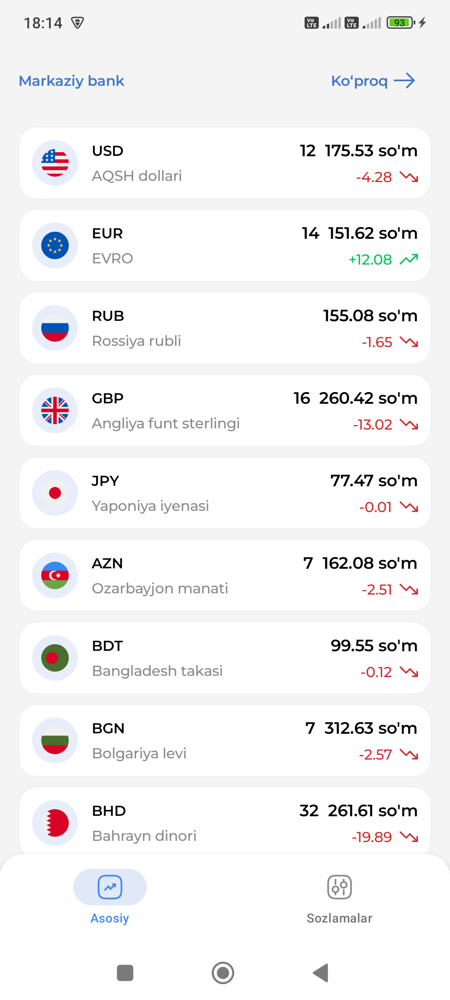
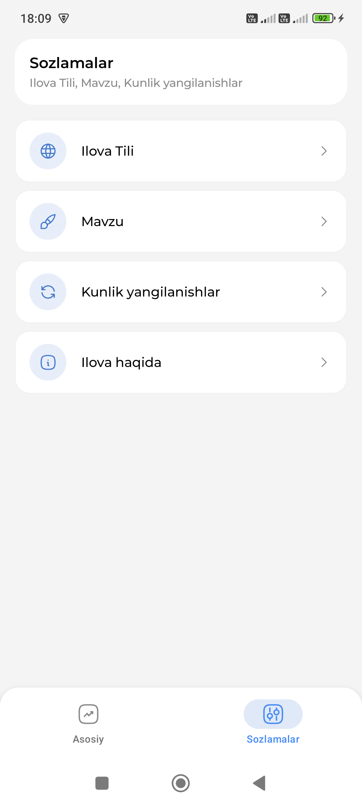
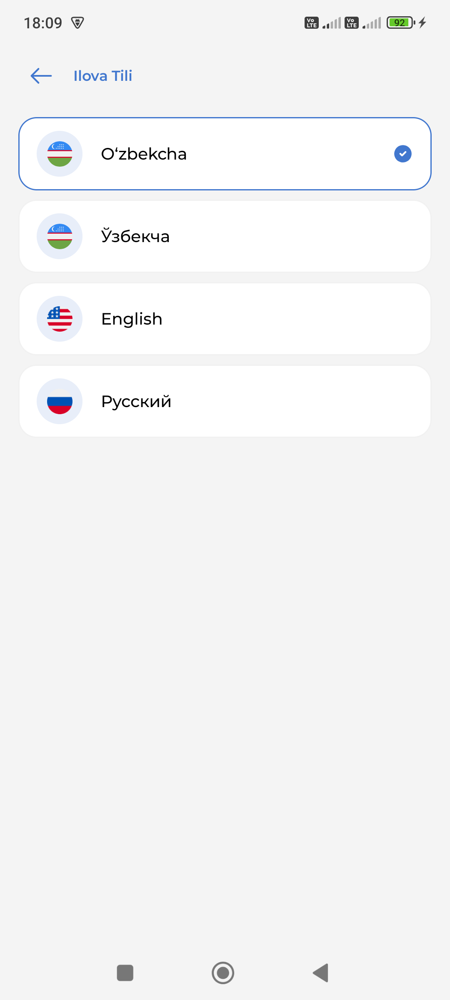
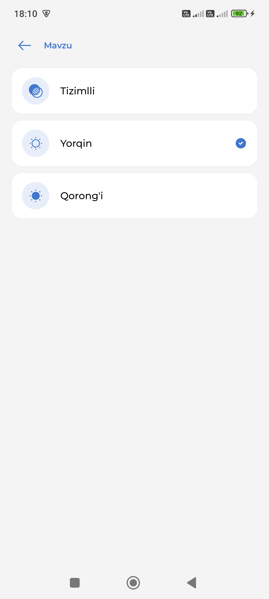
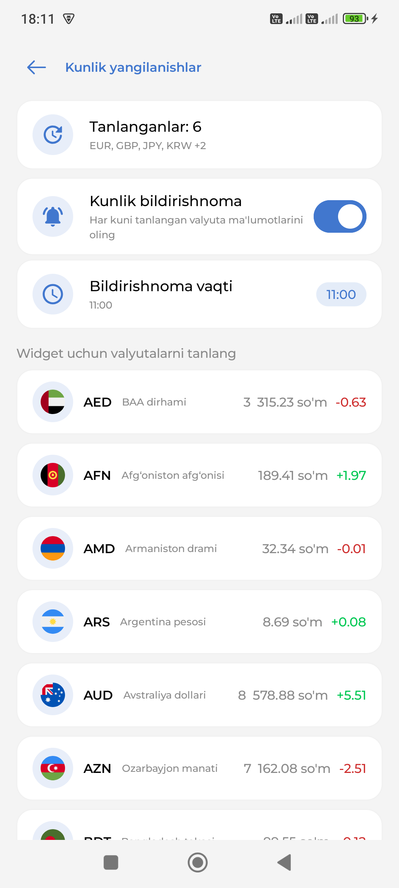
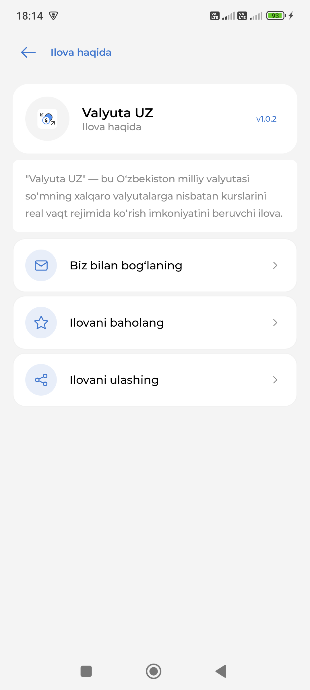
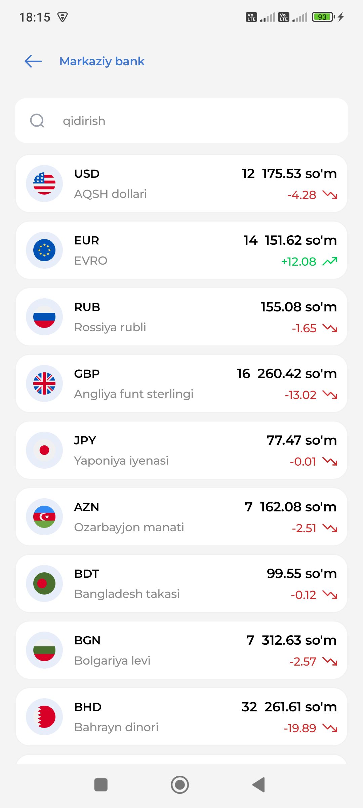
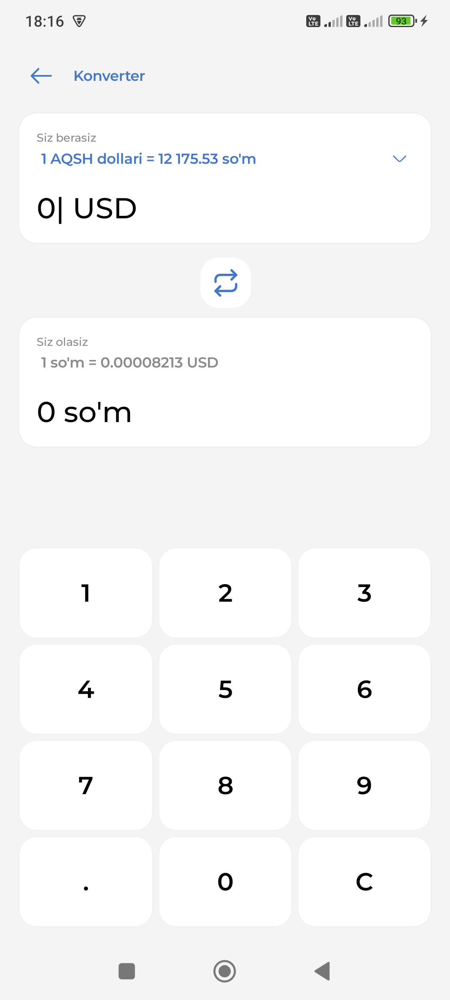

# Valyuta uz

Valyuta uz — O'zbekiston Markaziy Bankining valyuta kurslarini ko'rsatib beruvchi Android ilova. Ilova Markaziy Bank ma'lumotlarini saqlaydi va **oxirgi 6 soat ichida** internetga ulanmagan bo'lsa, eski ma'lumotlarni ko'rsatadi. Agar internetga ulanmagan holda 6 soatdan ko'p vaqt o'tgan bo'lsa, bo'sh ekran chiqadi.

## 📱 Ilova xususiyatlari

- 📊 **O'zbekiston Markaziy Banki ma'lumotlarini ishlatadi**
- 🌐 **Internet mavjud bo'lsa, yangilangan ma'lumotlarni yuklaydi**
- 🕛 **6 soatgacha oflayn rejimda ishlaydi**
- 🚫 **6 soatdan keyin internet bo'lmasa, bo'sh ekran chiqadi**

## 🛠 Texnologiyalar

- **Jetpack Compose** - UI yaratish uchun
- **Room Database** - Ma'lumotlarni saqlash uchun
- **Kotlin Coroutines** - Asinxron operatsiyalar uchun
- **Retrofit** - API orqali Markaziy Bank ma'lumotlarini olish uchun

## ⚙️ O'rnatish va ishlatish

```bash
# Reponi klonlash
git clone https://github.com/yourusername/valyuta-uz.git
cd valyuta-uz

# Ilovani ishga tushirish
./gradlew assembleDebug
```

## 🔗 API Manbasi

Ilova **O‘zbekiston Markaziy Banki** API dan foydalanadi:

- [Markaziy Bank API](https://cbu.uz/uz/arkhiv-kursov-valyut/)

## 📌 Ekran rasmlari

| Home | Settings |
|---|---|
|  |  |

| Language | Theme |
|---|---|
|  |  |

| Daily Updates | Info |
|---|---|
|  |  |

| Detail | Converter |
|---|---|
|  |  |

## 📥 Yuklab olish

📲 **Play Market orqali yuklab olish:** 

[](https://play.google.com/store/apps/details?id=uz.toshmatov.currency)


---

**📩 Aloqa:** Taklif yoki muammolar bo‘lsa, GitHub Issues orqali xabar bering yoki a.toshmatov.dev@gmail.com.
